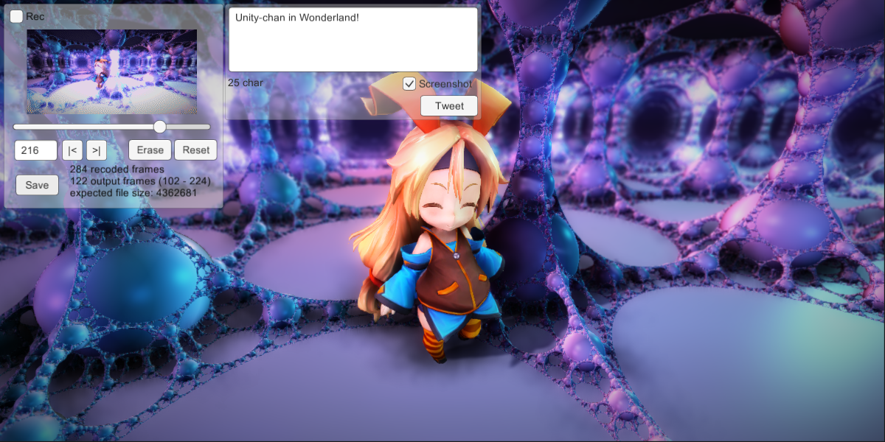
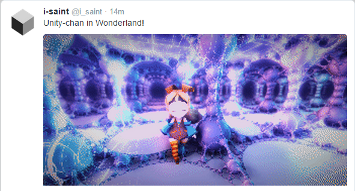
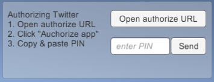

# TweetMedia

ゲーム内から Twitter へ画像やメッセージを投稿する Unity 用プラグインです。  
Twitter インテグレーションは他にもいくつかありますが、TweetMedia は画像と動画 (アニメ gif、mp4) の投稿まで対応しているのが特徴です。
ゲーム内からメッセージとスクリーンショットを投稿することを目的としたもので、現状それ以外の機能はありません。  
Vista 以降の Windows (32bit & 64bit) で動作します。ソースコードレベルでは CURL と C++11 が使える環境であればコンパイルできて動作するはずですが、未確認です。  

[FrameCapturer](https://github.com/unity3d-jp/FrameCapturer) がこれを用いてゲーム画面のキャプチャから Twitter への投稿までを実装しています。具体的な使い方の例になると思われます。  

### 使い方
1. [このパッケージ](https://github.com/unity3d-jp/TweetMedia/raw/master/Package/TweetMedia.unitypackage) をインポート
2. uGUI オブジェクト TweetMedia.prefab をシーン内に配置
3. TweetMedia の consumer_key, consumer_secret を設定

3 について、consumer key / secret は Twitter にアプリを登録することで発行されます。
アプリ登録の手順は簡単で、[このサイト](https://apps.twitter.com/) へ行き、"Create New App" をクリックして必要な項目を記入するだけです。  
consumer_key, consumer_secret は基本的に公開しない情報です。パッケージについているサンプルシーンも consumer_key, consumer_secret は未設定になっているのでご注意ください。  

ゲームをプレイする側は、ゲームに Twitter にアクセスする許可を与える必要があります。  
TweetMedia.prefab を使っている場合、"Open authorize URL" ボタンを押すとブラウザが開き、認証画面に移動します。  
ブラウザの認証画面の "Authorize app" を押し、その後出てくる数字の羅列 (PIN) をゲーム内の InputField ("enter PIN") にコピー＆ペーストして Send ボタンを押すことで認証が完了します。  
一度認証すればあとはその情報を保存することでこの手順は不要になります。(デフォルトで保存するようになっています)  
TweetMedia.prefab は見た目も機能も必要最小限しか備えていないため、独自に改良することをおすすめいたします。  

### 注意点
2015/06/10 現在、アニメ gif は 5 MB、mp4 は 15 MB までの容量制限があり、他にも解像度 (1280px 以内) や長さ (30 秒以内) など色々細かい制限があるようです。
(詳細は[こちら](https://dev.twitter.com/rest/public/uploading-media))  
これらの制限に引っかかった場合にサーバーから返ってくるメッセージは "The validation of media ids failed." で、具体的に何に引っかかったのかまではわかりません。
このため、ゲーム側でファイルの妥当性をチェックするか、ユーザー側への説明が必要になると思われます。  
Twitter の仕様は頻繁に変わるため、TweetMedia 側でのチェックはあえてやっていません。

### 謝辞
- Twitter の API を叩くのに twitcurl に手を加えたものを使用しています。オリジナルからの変更点は、画像/動画アップロードへの対応です。  
  オリジナル: https://github.com/swatkat/twitcurl  
  fork: https://github.com/i-saint/twitcurl  
- twitcurl は libcurl を使用しています。画像アップロードもこれで実装しました。  
  http://curl.haxx.se/libcurl/  
- JSON のパースに picojson を使用しています。
  https://github.com/kazuho/picojson
